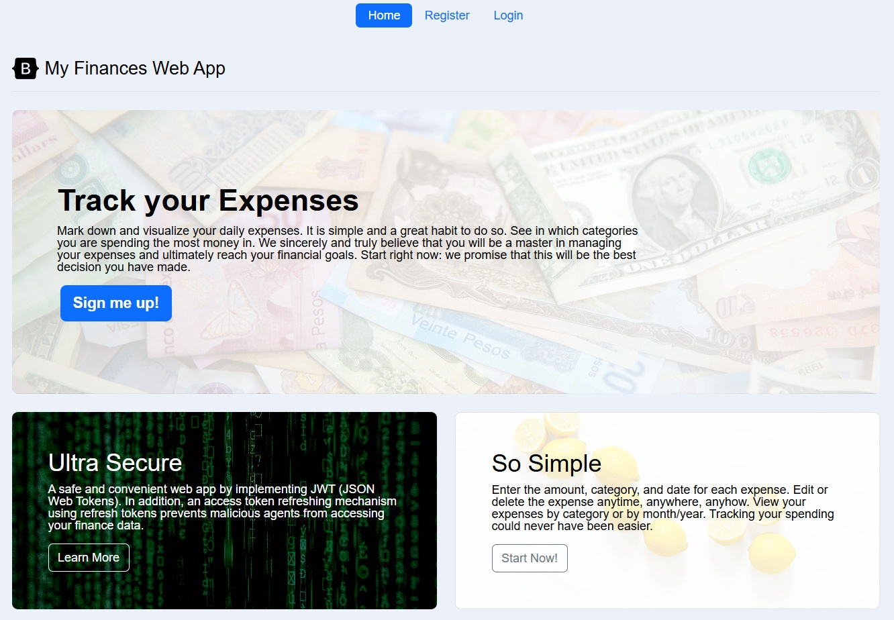
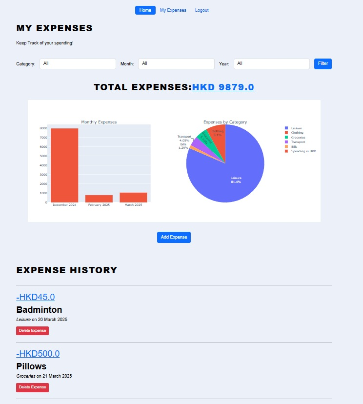
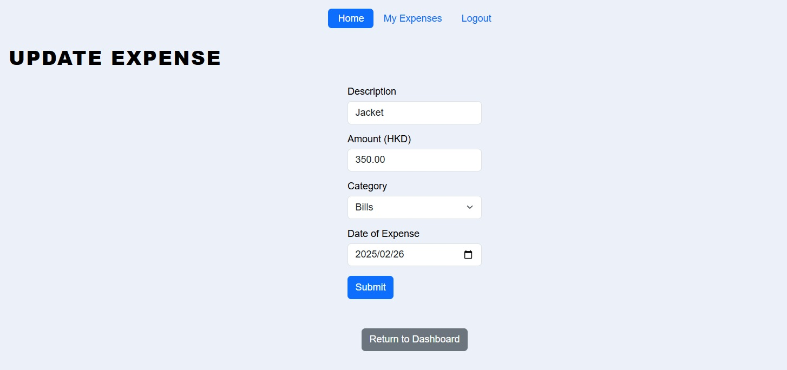
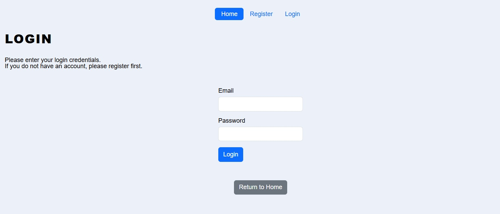
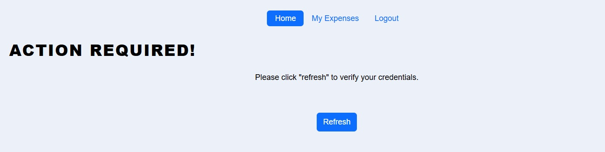

# Expense Tracker API with JWT Token Authentication

## Description
My second project of my professional portfolio, to help me learn data modeling and Token based user authentication.
It is a personal finance web app in which users could register and log in, and track their spending by recording their expenses.

JWTs (JSON Web Tokens) are implemented for authentication for API calls (protect the endpoints and identify the requester) using the Flask-JWT-Extended extension. 

- An access token and refresh token is issued upon log in (Stored in HTTP-only cookies)
- After the short-lived access token expires, users are prompted to refresh the token without the need to provide credentials again.
(Within the validity of the long-lived refresh token) 
- If the user decides to log out before the token expires, the tokens are revoked by unsetting the cookies.

This project uses Bootstrap as frontend framework, Flask as backend framework, and SQLite for database.

Project Idea from [Roadmap.sh](https://roadmap.sh/backend/project-ideas#4-expense-tracker-api)

## Instructions
- After landing in home page, click on "Register" to create an account. 

- Provide a username, email, and password to register.

- After logging in, you can go to your dashboard (my expenses page) start to adding expense entries.

- Edit the expense by pressing the dollar amount; Delete by pressing the delete button.

- On the dashboard, you can see all your expenses, and delete or edit them. There is also a spending summary, and you could filter the expenses by category or by month/year.

## Acknowledgements

- **Bootstrap**: This project uses Bootstrap for styling and responsive design. More information can be found on the [Bootstrap website](https://getbootstrap.com/).

- **100 Days of Code: The Complete Python Pro Bootcamp**: Many concepts and code snippets in this project were inspired by the Udemy course [100 Days of Code: The Complete Python Pro Bootcamp](https://www.udemy.com/course/100-days-of-code/) by Angela Yu.

- **Roadmap.sh**: [This](https://roadmap.sh/backend/project-ideas#4-expense-tracker-api) is where I got the idea of the project from.

## Contributing

Pull requests are welcome. For major changes, please open an issue first
to discuss what you would like to change.

## Some Screenshots
### Home Page

### Dashboard Page

### Edit Expense Page

### Login Page

### Refresh Token Page

